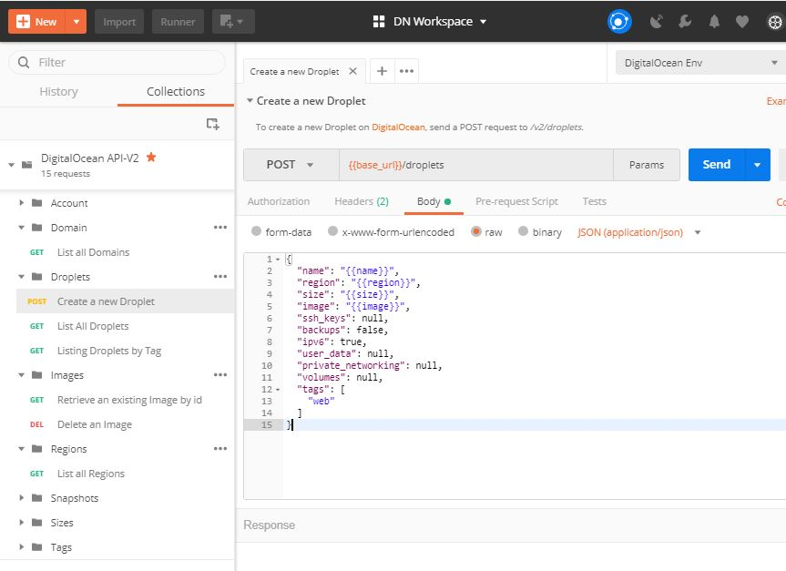

[DigitalOcean][do-api]-Postman Collection
========================================
Postman Collection for [DigitalOcean API][do-api]

This repo is a placeholder to maintain [DO API][do-api] Postman Collections (not owned by DO). It has a list of requests,
with collection & environment variables and response examples. Contribution to [DigitalOcean on GitHub][do-github] and as most of the descriptions are copied from
beautifully & well documented API, please refer the [Official DigitalOcean API][do-api]. This is just Postman collection!!

>> The [DigitalOcean API][do-api] allows you to manage Droplets and resources within the DigitalOcean cloud 
>> in a simple, programmatic way using conventional HTTP requests. The endpoints are intuitive and
>> powerful, allowing you to easily make calls to retrieve information or to execute actions.

Please follow this tutorial to import this [Postman Collection][pm-collection].

# Keys and variables

## Environment level
- base_url
- bearer_token
- page
- per_page

## Collection level
- action_id
- certificate_id
- domain_name
- droplet_id
- floating_ip
- image_id
- image name
- name (domain)
- project_id
- region
- resource_id
- snapshot_id
- ssh_key_id
- tag_name

## TODOs
- [x] Accounts
- [x] Actions
- [ ] Block Storage
- [ ] Block Storage Actions
- [ ] CDN Endpoints
- [x] Certificates
- [ ] Databases
- [x] Domains
- [ ] Domains Records
- [x] Droplets
- [ ] Droplet Actions
- [ ] Firewalls
- [x] Floating IPs
- [ ] Floating IPs Actions
- [x] Images
- [ ] Images Actions
- [ ] Kubernetes
- [ ] Load Balancers
- [x] Projects
- [ ] Project Resources 
- [x] Regions
- [x] Sizes
- [x] Snapshots
- [x] SSH-Keys
- [ ] Tags

## Author
[Dawit Nida](https://github.com/dawitnida)

[do-github]: <https://github.com/digitalocean>
[do-api]: <https://developers.digitalocean.com>
[pm-collection]: <https://www.getpostman.com/docs/collections>
